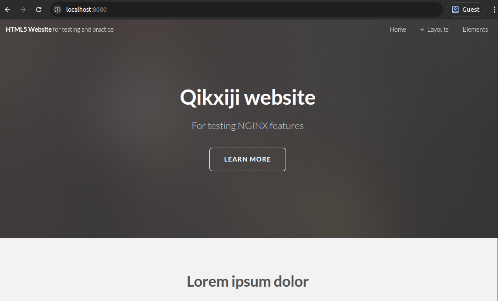

# NGINX/HTML website

Развёртывание простого сайта HTML+CSS на NGINX в Docker. 

- Одноконтейнерное приложение
- Расширенная конфигурация NGINX
- Файл /nginx/Nginx_lesson.docx с моим конспектом теории и практики NGINX

## Требования

- Установить Docker

## Сборка образа Docker

```
docker build -t nginx_website .
```

## Запуск контейнера

```
docker run --rm --detach -p 8080:8080 nginx_website:latest
```

## Открыть веб-сайт

В поисковой строке браузера набрать `localhost:8080`
